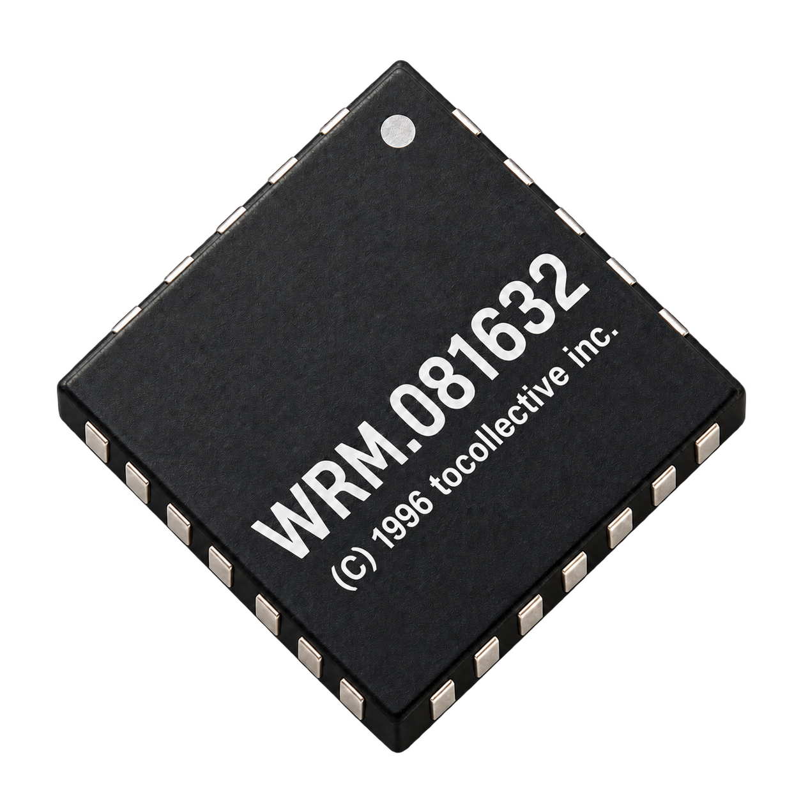

# WRM.081632



WRM.081632 – is a 32-bit, RISC based, little-endian CPU architecture.

Architecture reference: [ISA](docs/INSTRUCTIONS.md),
[machine and devices](docs/SPECIFICATION.md), [ABI](docs/ABI.md),
and [implementation notes for kernels and drivers](docs/SPECIFICS.md).

```sh
cmake -S . -B build     # RelWithDebInfo unless -DCMAKE_BUILD_TYPE says otherwise
cmake --build build && ctest --test-dir build
```

A `Debug` build runs several times slower and may not keep up with the
32 MHz clock. The title bar shows the speed the machine really runs at
and its share of the clock rate; below 100% the guest's time, which it
counts in ticks, falls behind the host's. `--unthrottled` runs it as fast
as the host can instead (see [Speed and determinism](#speed-and-determinism)).

# Disclaimer

# THIS PROJECT IS VIBECODED AS A TOY FOR MYSELF. IF YOU DON'T LIKE IT, DON'T USE IT.

## Running

```sh
python3 mc/mc.py --rom wfw/src/main.m -o firmware.rom
bin/wrm081632 [--rom PATH] [--ram SIZE[,...]] [--clock HZ]
              [--hdd PATH] [--hdd-serial N=SERIAL] [--floppy PATH]
              [--share PATH[:ro]] [--mute] [--headless]
              [--no-net] [--net-allow RULE] [--net-deny RULE]
              [--net-forward [ADDR:]HOST_PORT:GUEST_PORT]
              [--unthrottled] [--deterministic] [--rtc=SECONDS] [--seed=N]
              [--input PATH] [--monitor[=PORT]] [--pause] [--load PATH]
              [--trace[=PATH]] [--debug]
```

| Option             | Description                                              |
|--------------------|----------------------------------------------------------|
| `--rom PATH`       | firmware image, `firmware.rom` by default                |
| `--ram SIZE[,...]` | RAM in slots 0–3, mapped back to back from address 0: `1M`, `2M`, `4M`, `8M`, `16M` or `32M` each (`--ram 4M,4M`); `4M` by default |
| `--clock HZ`       | clock rate, with an optional `k`, `M` or `G` suffix; `32M` by default |
| `--hdd PATH`       | disk image for disk 0; a second `--hdd` attaches disk 1 (see [Booting from disk](#booting-from-disk)) |
| `--hdd-serial N=SERIAL` | the serial number disk `N` reports to `IDENTIFY`, up to 31 printable characters; by default it is made from the image's path |
| `--floppy PATH`    | disk image in the floppy drive; a file dropped on the window replaces it while the machine runs; at most 1.44MB (2880 sectors) |
| `--share PATH[:ro]` | share a host folder with the guest (see [Shared folder](#shared-folder)); read-only with `:ro` |
| `--mute`           | no sound from the beeper and the audio card               |
| `--no-net`         | cut the Ethernet card off the host's network (see [Network](#network)) |
| `--net-allow RULE` | let the guest connect and send to `RULE`, `ADDR[/BITS][:PORT[-PORT]]` (e.g. `127.0.0.1:8000-8099`); see [Network](#network) |
| `--net-deny RULE`  | keep the guest from `RULE`; of all the rules, the last that matches wins |
| `--net-forward [ADDR:]HOST_PORT:GUEST_PORT` | connections and datagrams to `ADDR:HOST_PORT` of the host go to the guest's TCP and UDP port `GUEST_PORT` (`ADDR` is `127.0.0.1` if left out) |
| `--headless`       | no window and no sound (the video card, the beeper and the audio card still run, but nothing is shown or heard); the UART console still uses stdin and stdout |
| `--unthrottled`    | run as fast as the host can, not at the clock rate (see [Speed and determinism](#speed-and-determinism)) |
| `--deterministic`  | the same ROM, disks and input give the same run: `--unthrottled`, a virtual RTC, a seeded random number generator, the network polled at fixed ticks |
| `--rtc=SECONDS`    | a virtual RTC: it starts at `SECONDS` after 1970-01-01 UTC and counts clock ticks (`0` with `--deterministic`) |
| `--seed=N`         | the random number generator gives the same bits on every run, the ChaCha20 stream of `N`, instead of the host's (`0` with `--deterministic`) |
| `--input PATH`     | feed the keyboard, the UART, the mouse and the power button from an [input script](#input-scripts) |
| `--monitor[=PORT]` | the [monitor](#monitor), a debugging console on `127.0.0.1:PORT` (`4040` by default) |
| `--pause`          | start with the machine stopped, for the monitor          |
| `--load PATH`      | start from a [snapshot](#snapshots)                       |
| `--trace[=PATH]`   | log every instruction that reaches write-back to `PATH`, or to stderr (see [Debugging](#debugging)) |
| `--debug`          | dump the CPU state when the machine stops or the emulator quits |
| `-h, --help`       | show the options                                         |

The UART has stdout to itself: the emulator's own messages go to stderr.

The emulator quits when the guest powers the machine off through the
power controller (see [docs/SPECIFICATION.md](docs/SPECIFICATION.md#power-controller));
the exit code written there becomes the process exit status. In headless
mode it also quits when the CPU halts:

| Exit status | Reason                                                   |
|-------------|----------------------------------------------------------|
| guest's     | power off                                                |
| `0`         | `HLT` (headless only)                                    |
| `1`         | a fault the CPU couldn't handle (headless only, reported on stderr), or an emulator error |

With a window, a halted machine keeps the window open; Ctrl+Alt+R resets
it, as at any other time. Ctrl+Alt+S saves a [snapshot](#snapshots) to
`wrm081632.snap` in the current directory, Ctrl+Alt+L loads it back.

Closing the window or Ctrl+C in the terminal is the power button: if the
guest has enabled the power controller's IRQ in the PIC and still runs,
the emulator asks it to power off and waits; doing it again quits at
once. A guest that doesn't listen is cut off at once, as before.

## Shared folder

`--share PATH` gives the guest a folder of the host: software opens,
reads and writes its files by path through the shared folder device,
without a disk image and without a file system driver of its own (see
[docs/SPECIFICATION.md](docs/SPECIFICATION.md#shared-folder)). Paths
can't leave the folder: `..` is refused, and so is a symbolic link that
leads out of it. `--share PATH:ro` shares it read-only. Files the guest
writes are in the folder at once; the guest's `SYNC` puts them on the
host's disk.

```sh
bin/wrm081632 --share ./exchange          # the guest sees ./exchange as /
```

## Mouse

The mouse is relative, like a PS/2 one. Once software has enabled it, a
click in the window hands it the pointer (the click itself isn't passed
on); Ctrl+Alt or switching to another window takes the pointer back.
The title bar says when the machine has it. Software can make it
absolute instead, like a USB tablet: the machine then follows the
host's pointer over the window, in pixels of its video mode, and nothing
is captured; the video card's hardware cursor can draw the pointer. See
[docs/SPECIFICATION.md](docs/SPECIFICATION.md#mouse).

## Network

The machine has an Ethernet card: software sends and receives frames
and brings its own TCP/IP stack, and the emulator plays the network
behind the card, as QEMU's user networking does. The guest gets
`10.0.2.15` by DHCP, with the gateway `10.0.2.2` (which is also the host
itself) and the DNS server `10.0.2.3`; its TCP, UDP and ping go out
through the host's sockets, so nothing needs setting up and no
privileges. Ping leaves the machine only where the host allows
unprivileged ICMP sockets (macOS; Linux with
`net.ipv4.ping_group_range`); the gateway always answers it. The card is
connected unless the emulator runs with `--no-net`, which keeps a guest
off the network. A booted system provides its own network driver and
protocol stack. See
[docs/SPECIFICATION.md](docs/SPECIFICATION.md#ethernet-card).

The guest reaches the internet, but not the host itself or the networks
around it: connections to `127.0.0.0/8` (and so to `10.0.2.2`), the
private networks (`10.0.0.0/8`, `172.16.0.0/12`, `192.168.0.0/16`),
link-local and other non-public addresses are refused with a reset, and
datagrams and pings to them are dropped, so a guest can't get at
services that trust the host. Rules open or close more, each an address
with an optional prefix length and port range; the last rule that
matches decides:

```sh
bin/wrm081632 --net-allow 127.0.0.1:8000           # a server on the host
bin/wrm081632 --net-allow 192.168.1.0/24           # the local network
bin/wrm081632 --net-deny 0.0.0.0/0 --net-allow 93.184.215.14:443  # one site
```

`--net-forward` lets the host reach the guest: connections and datagrams
to a port of the host go to a port of the guest while the card is on,
from `10.0.2.2`. By default the host's port is on `127.0.0.1`, so only
programs on the host can connect; `--net-forward 0.0.0.0:8080:80` lets
the whole network reach a server on the guest's port 80 through the
host's port 8080.

A browser can't open TCP connections or look up host names, so the web
build asks a proxy on the host to do it, `tools/netproxy.py` (only the
standard library). It prints a random token and the URL parameter that
passes it to the page:

```sh
python3 tools/netproxy.py            # 127.0.0.1:8080
# netproxy: open the emulator's page with ?netproxy=127.0.0.1:8080/TOKEN
```

Open the page as `wrm081632.html?netproxy=127.0.0.1:8080/TOKEN`. Every
page open in the browser can reach the proxy, so it serves only requests
with the token and only pages from `localhost` or `127.0.0.1` (any port),
and connects only to public addresses:

| Option          | Effect                                                   |
|-----------------|----------------------------------------------------------|
| `--token TOKEN` | a fixed token instead of a random one                    |
| `--no-token`    | no token; the page then needs no `?netproxy=` for `127.0.0.1:8080` |
| `--origin URL`  | also serve pages from this origin, e.g. `https://example.com`; `'*'` for any |
| `--allow CIDR`  | also connect to a loopback, private or other non-public network, e.g. `127.0.0.1/32` |
| `--listen ADDR`, `--port N` | where it listens, `127.0.0.1:8080` by default |

In a browser only TCP and DNS go out, through the proxy: UDP, ping and
forwarded ports are not available.

## Speed and determinism

The emulator keeps the pipeline cycle-exact, so a trace, `CYCLE` and the
pipeline tests give the same results however the host runs it. Devices
only run when they have something to do — the end of a frame, a DMA word,
a timer expiring — and catch up in one go before the CPU reads them; a
CPU waiting in `WFI` skips straight to the next such event.

`--unthrottled` drops the clock rate as a limit: the machine runs as fast
as the host can, in slices of 10ms of machine time. The guest's time
(timer, frames, sound) then runs faster than the host's, so sound plays
in pieces; the RTC still tells the host's time unless it is virtual.

`--deterministic` makes a run depend only on what the machine is given:
it runs unthrottled, the RTC is virtual (from `--rtc=SECONDS`, or 1970),
the random number generator is seeded (from `--seed=N`, or 0), disk
serial numbers are made from the images' file names, and the network is polled every millisecond of machine time instead of
whenever the host gets to it. Input from the window and the terminal
still comes when it comes; an input script gives it at exact ticks.

### Input scripts

`--input PATH` feeds the machine from a file, one event per line, at the
clock tick (since power-on) it names, before that tick runs; `+N` is `N`
ticks after the event before. `#` starts a comment.

```
1000      key 4 down        # a key by its USB HID usage ID (4 = A)
+500      key 4 up
32000000  uart hello\n      # bytes for the UART, with \n \r \t \\ \xNN
+0        mouse 5 -3        # motion (a relative mouse)
+0        point 320 240     # where the pointer is (an absolute mouse)
+0        button left down  # left, right or middle; down or up
+0        wheel -1
64000000  power             # the power button: asks the guest to power off
```

Events reach the devices as the host's would: a full FIFO drops them, a
disabled mouse ignores them.

## Booting from disk

A disk image is a plain file of 512-byte sectors. The disk is written
back to the file, and a file the emulator can't write is attached
read-only. The emulator locks the images it uses: an image another
emulator already has is attached read-only, with a warning, and one it
writes isn't attached at all, so two machines never write one image.

The firmware (`wfw/`, written in M: see
[mc/docs/spec](mc/docs/spec/README.md)) boots from the floppy, or else from
disk 0, when it holds a boot image. A boot image starts with a small
header and is loaded to `0x00010000`
([docs/SPECIFICATION.md](docs/SPECIFICATION.md#boot-protocol)). The M
compiler makes one by default; padded to whole sectors, it is itself a
bootable disk image:

```sh
python3 mc/mc.py mc/examples/example.m -o hdd0.img
bin/wrm081632 --hdd hdd0.img
bin/wrm081632 --floppy hdd0.img     # the same image boots from the floppy
```

Without a boot image on either drive the firmware opens a diagnostic menu
on the screen. Press `r` to retry booting after changing a disk, `d` to
list detected devices, `h` for help, or `p` to power off. The menu uses
the emulated keyboard; firmware messages are not sent to the UART. A
floppy can be swapped at run time by dropping an image file on the
window; the guest sees it in the drive's `STATUS`
([docs/SPECIFICATION.md](docs/SPECIFICATION.md#floppy-drive)).
The calling conventions for code on the machine are in
[docs/ABI.md](docs/ABI.md).

## Toolchain

| Tool              | What it does                                              |
|-------------------|-----------------------------------------------------------|
| `mc/asm.py`    | assembler: a flat image at `--base` (the test ROMs), or with `-c` an ELF object file |
| `mc/ld.py`     | linker: object files and `ar` archives to a boot image, a ROM image or an ELF executable (`--layout boot\|rom\|exec`), with veneers for far calls and a symbol map (`--map`) |
| `mc/mc.py`        | the M compiler: each module to an object file of its own, linked with the runtime |
| `mc/disasm.py` | disassembler for flat images                              |

Object files and executables are ELF32 with `e_machine` = `0x0816`
([docs/ABI.md](docs/ABI.md#object-files)), so `llvm-readelf` and
`llvm-objdump -h` read their headers, sections, symbols and relocations.
Modules can be compiled one by one and linked later:

```sh
python3 mc/mc.py -c lib.m -o lib.o          # one module (imports are read, not compiled)
python3 mc/mc.py -c main.m -o main.o
python3 mc/mc.py main.o lib.o -o prog.img   # linked with the runtime: a boot image
python3 mc/mc.py -S lib.m -o lib.s          # the assembly asm.py -c gets

python3 mc/asm.py -c start.s -o start.o    # assembly by hand
python3 mc/ld.py --layout exec start.o lib.o -o prog.elf --map prog.map
```

In an object file a label is an offset in its section; `.text`, `.data`,
`.rodata`, `.bss`, `.tdata`, `.tbss` and `.section` switch sections,
`.globl` and `.weak` export symbols, and a name defined nowhere in the
file is another file's. `%pcrel_hi`/`%pcrel_lo` and `%tprel*` give
position-independent and thread-local addresses (`asm.py --help` lists
the syntax, `ld.py --help` the layouts and the symbols it defines).

## Debugging

**State dump.** When the CPU halts on a fault it couldn't handle, the
emulator prints its state on stderr; with `--debug` it does so whenever
the machine stops (`HLT`, power off) or the emulator quits. A halted CPU
keeps its pipeline, so `MEM/WB` holds the instruction that stopped it:

```
CPU: halted by a fault at 0xFE000044: load page fault (0x00400000)
  pc FE000044  cycles 1234  retired 1180  irq 0
  r0  00000000  r1  00400000  r2  00000000  r3  00000000
  ...
  status   00000010  EXL
  epc      FE000010
  ...
  ptbr     00010001  paging on
  MEM/WB  FE000044  00002144  lw r1, 0(r1)                  ! load page fault (0x00400000)
  EX/MEM  bubble
  ...
```

**Trace.** `--trace` writes a line for every instruction that reaches
write-back: the cycle, its address and word, the instruction, and what it
changes — a register (`r1 = 0x...`), memory (`[0x...] = 0x...`, as wide
as the store), a control register (`status = 0x...`) or the PC after
`IRET` — or the fault it raises (`! cause (BADADDR)`). A taken interrupt
gets a line of its own, at the address it returns to:

```
         5  FE000000  00101E30  lui r30, 0x00080              r30 = 0x00100000
        10  FE00000C  00082005  mtcr ivec, r1                 ivec = 0xFE0000D0
       812  FE000040  0200014A  sw r1, 128(r0)                [0x00000080] = 0x0000002A
      9031  FE000120  --------                                ! interrupt
```

Squashed instructions never reach write-back, so they aren't traced.
Tracing is slow (the host usually falls behind the clock rate, and the
machine just runs slower) and the log grows by about 80 bytes per
instruction, so it suits short test ROMs best.

**Disassembler.** `mc/disasm.py` prints a ROM image in the same
syntax as the trace; the output assembles back to the same bytes.
Words the assembler can't produce (data, reserved bits set) are shown as
`.word`, and runs of the same word are folded into `*` unless `--all`:

```sh
python3 mc/disasm.py firmware.rom [--base 0xFE000000] [--start ADDR] [-n WORDS]
```

### Monitor

`--monitor` opens a console on a TCP port of `127.0.0.1` (only programs
on the host can connect): `nc 127.0.0.1 4040`. It stops the machine
between two instructions, steps it, shows and changes registers and
memory and sets breakpoints and watchpoints. These are the emulator's:
the guest doesn't see them, they cost it nothing until they hit, and
they work in ROM. `--pause` starts the machine stopped, before its first
instruction.

| Command | |
|---------|-|
| `c`, `p`, `s [N]` | go on, stop, run `N` instructions and stop |
| `r` | registers |
| `x ADDR [N]`, `xp ADDR [N]` | memory at a virtual or a physical address |
| `w ADDR VALUE`, `wp ADDR VALUE` | write a word of RAM |
| `d [ADDR] [N]` | disassemble, by default at the next instruction |
| `b ADDR` | stop before the instruction at `ADDR` |
| `watch ADDR [LEN] [r\|w\|rw]` | stop after a load or store touches the range (a write by default) |
| `del ADDR\|all`, `list` | remove breakpoints and watchpoints, list them |
| `info` | the devices |
| `reset`, `save PATH`, `load PATH` | reset the machine, save or load a [snapshot](#snapshots) |

A stop is like an interrupt that never enters a handler: everything
before the next instruction has run and nothing after it has, so the
registers are exact. The client is told when the machine stops at a
breakpoint, a watchpoint or after a step:

```
> b 0xFE000040
breakpoint at FE000040
> c

breakpoint
*> FE000040  0200014A  sw r1, 128(r0)
>
```

Software can debug itself too: `STATUS.SS` traps after each instruction
and two triggers match fetches, loads and stores
([docs/INSTRUCTIONS.md](docs/INSTRUCTIONS.md#debugging)).

### Snapshots

A snapshot (monitor `save`, Ctrl+Alt+S) holds the whole machine: the CPU
down to its pipeline and TLB, RAM, VRAM and every device. Loading one
(`load`, Ctrl+Alt+L, `--load PATH`) goes on exactly where it was saved.
Disk images are referenced, not copied: loading warns if one has changed
since, and the floppy drive gets back the disk it had. Network
connections can't be saved; after a load the guest sees them closed,
and so are the shared folder's open files. The random number generator
takes new bits from the host after a load (a seeded one goes on with its
stream). A
snapshot loads only with the same ROM, clock rate and RAM, into the same
build of the emulator.

## Tests

```sh
python3 tests/run.py [--emulator PATH] [tests/isa/alu.asm ...]
ctest --test-dir build --output-on-failure
```

Each `tests/<group>/<name>.asm` is a test ROM: `tests/run.py` assembles it
and runs it with `--headless` (by default with `bin/wrm081632`); CTest
runs every ROM through it as a test of its own.

| Group      | What                                                        |
|------------|-------------------------------------------------------------|
| `isa`      | every instruction, control registers, exceptions, user mode |
| `pipeline` | forwarding and stalls, cycle timing, precise faults and interrupts |
| `mmu`      | pages and superpages, permissions, TLB invalidation and its modes, `U` |
| `disk`     | the disk controller: transfers, scatter-gather lists, `FLUSH`, `IDENTIFY`; the floppy drive, the firmware booting from disk |
| `video`    | the video card: modes, palette, drawing engine, DMA, VBLANK |
| `sound`    | the beeper's registers and `DURATION` timing; the audio card's voices, loops, signals and DMA faults |
| `mouse`    | the mouse's registers (headless, so without events)         |
| `input`    | an input script in deterministic mode, the UART from stdin  |
| `net`      | the Ethernet card and its rings, ARP, ping and DHCP; TCP both ways through a forwarded port, UDP, DNS; the rules; no link (`--no-net`) |
| `rtc`      | the real-time clock: the host's time and its latch, the alarm and its IRQ line; the virtual time |
| `rng`      | the random number generator: the host's bits, and the ChaCha20 stream of a seed |
| `share`    | the shared folder: paths and their limits, files, directories, handles; read-only, and no folder |
| `power`    | the power controller: its state at power-on, a reset by software and `RESET_CAUSE`; what a reset clears and what it keeps |
| `devices`  | every device's `ID` register, unused pages of the I/O region |

A test includes `tests/common/harness.asm` and defines `test_main`. It
sets `r28` to the number of each check and ends with `j pass`, or
branches to `fail`, which prints the check number and `r1`–`r4` and
powers off with the check number as the exit code. A test passes only
if it powers off with `0` after printing `PASS`.

Comment lines in a test set up the machine it runs on:

| Line              | Effect                                                  |
|-------------------|---------------------------------------------------------|
| `; @hdd N`        | attach a disk of `N` sectors; the word at byte offset `o` of sector `s` is `s << 16 \| o / 4` |
| `; @hdd FILE.asm` | attach a boot image assembled from `FILE.asm` (relative to the test) at `0x00010000` |
| `; @floppy SPEC`  | put a disk in the floppy drive, `N` or `FILE.asm` as for `@hdd` |
| `; @args ARGS`    | more emulator options, e.g. `--ram 4M,2M`               |
| `; @rom FILE.m`   | run a ROM compiled from M (e.g. `../../wfw/src/main.m`) instead of the test itself |
| `; @input EVENT`  | a line of the [input script](#input-scripts), e.g. `; @input 1000 key 4 down` |
| `; @stdin TEXT`   | bytes on the emulator's stdin (the UART), with `\n`, `\t`, `\\` and `\xNN` escapes |
| `; @share [ro]`   | share a fresh folder holding `hello.txt` and `sub/data.bin` (see `tests/run.py`); `ro` makes it read-only |

Each `@hdd` attaches the next disk, 0 and then 1.

CI also runs every test with the emulator built with AddressSanitizer and
UndefinedBehaviorSanitizer; locally:

```sh
cmake -S . -B build-asan -DWRM081632_SANITIZE=address,undefined
cmake --build build-asan && ctest --test-dir build-asan
```

## Web (Emscripten)

```sh
emcmake cmake -S . -B build-web
cmake --build build-web
emrun bin/wrm081632.html
```

The firmware is packed into the build from `bin/firmware.rom`
(override with `-DWRM081632_WEB_FIRMWARE=path`). The UART console has
no input in the browser; its output goes to the page and the JS console.
For the network, run `tools/netproxy.py` alongside (see [Network](#network)).

The page (`web/shell.html`) keeps disk images in the browser: *Load
image* puts one in as disk 0 and restarts the machine with it, *Insert*
puts one in the floppy drive while the machine runs (so does dropping a
file on the screen, but that one isn't kept). They are saved in the
browser's IndexedDB for the page's address, so the next visit starts
with them; the guest's writes are saved when it flushes the disk and
every few seconds. *Download* gives the disk image back as a file,
*Forget saved disks* deletes them.

# Useful links

[Pentium](https://en.wikipedia.org/wiki/Pentium_(original))
[xremu](https://github.com/xrarch/xremu/)
[fox32](https://codeberg.org/fox32-arch/fox32/)
[fox32 hardware reference](https://host12prog.github.io/fox32hw-reference/)
[Aphelion ISA](https://codeberg.org/orbitsystems/aphelion/src/branch/main/spec/Aphelion%20ISA.pdf)
[RISC-V ISA](https://www2.eecs.berkeley.edu/Pubs/TechRpts/2016/Archive/EECS-2016-118.pdf)
[MIPS ISA](https://www.cs.gordon.edu/courses/cs311/handouts-2015/MIPS%20ISA.pdf)
[RISC Pipeline](https://en.wikipedia.org/wiki/Classic_RISC_pipeline)
